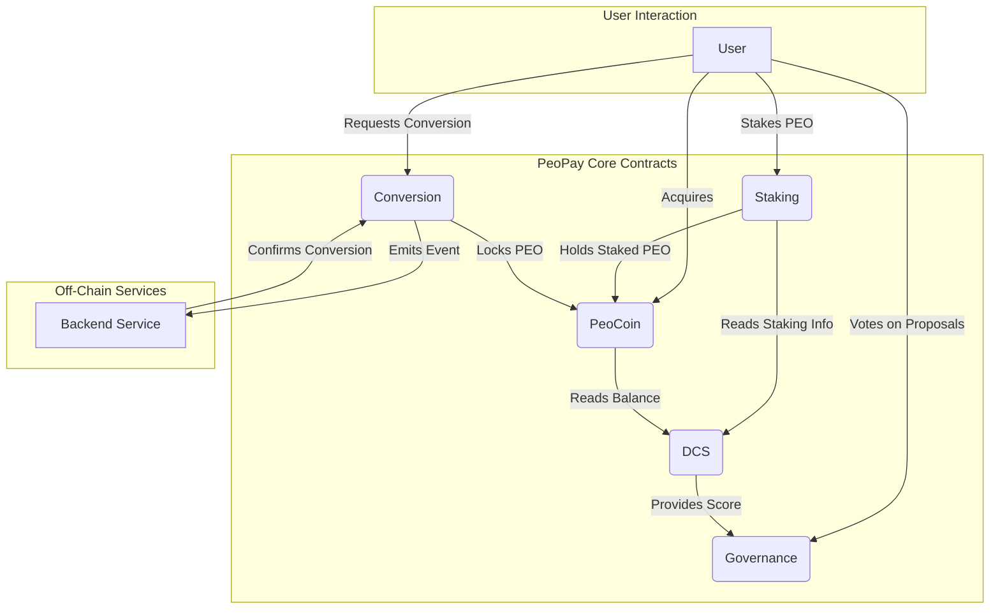

# PeoPay-Core
[](https://www.gnu.org/licenses/gpl-3.0)
[](https://docs.peopay.io/)
[](https://peopay.io/)
[](https://polygon.technology/)
[](https://eips.ethereum.org/EIPS/eip-20)
[](https://book.getfoundry.sh/)
[](https://openzeppelin.com/contracts/)
[](https://polygonscan.com/)

## Amoy Testnet Contracts

| Contract   | Address                                    | Description                                                        |
|------------|--------------------------------------------|--------------------------------------------------------------------|
| PeoCoin    | [0x7d66d92a1cba3d8775890a6815eb17f45efdb2e1](https://www.oklink.com/amoy/token/0x7d66d92a1cba3d8775890a6815eb17f45efdb2e1) | Test deployment of PEO token on the Amoy Testnet.                  |
| Staking    | [0x122B9bE8de0e9288C1c8201378086D04b4FFD265](0x122B9bE8de0e9288C1c8201378086D04b4FFD265) | Test deployment of Staking contract on the Amoy Testnet.           |
| DCS        | [0x26EeB0c59277D00df23204b86A9C5beE4E9c3DA7](https://www.oklink.com/amoy/address/0x26eeb0c59277d00df23204b86a9c5bee4e9c3da7) | Test deployment of Dynamic Contribution Scoring on the Amoy Testnet. |

**PeoPay-Core** is the foundational repository for the [PeoPay](https://peopay.io/) ecosystem. It contains the core smart contracts and logic for the PeoCoin token (PEO), staking, governance, conversion (crypto-to-mobile), and the Dynamic Contribution Scoring (DCS) system. These contracts form a decentralized infrastructure that supports staking rewards, governance proposals, transaction conversions, and a flexible scoring mechanism to reward active contributors.

For a detailed technical overview and developer guides, refer to the official [PeoPay Documentation](https://docs.peopay.io/).

---

## Overview

- **PeoCoin (PEO):**  
  An ERC-20 token serving as the primary utility token in the PeoPay ecosystem. Mintable, burnable, and managed by an owner account.

- **Staking:**  
  Enables users to stake PEO tokens to earn rewards over time. Includes lock periods, APY calculations, and optional tier multipliers.

- **Governance:**  
  Empowers PEO holders to propose and vote on ecosystem changes. Voting power is determined by DCS scores to reward active participants.

- **DCS (Dynamic Contribution Scoring):**  
  Computes a user’s contribution score based on PEO balance, staking duration, governance participation, and other metrics. Scores influence staking rewards and governance voting power.

- **Conversion (Crypto-to-Mobile):**  
  Facilitates off-chain conversion of PEO to mobile money. Users request conversions, and the backend service confirms them, enabling seamless integration with traditional financial systems.

---

## System Architecture

The PeoPay-Core contracts are designed to be modular and interoperable. Here’s a high-level overview of how they connect:



-   **`PeoCoin`** is the central token. It is a standard ERC-20 contract that forms the economic foundation of the ecosystem.

-   **`Staking`** contract allows users to lock their `PeoCoin` to earn rewards. This contract holds staked tokens and records the staking duration for each user.

-   **`DCS` (Dynamic Contribution Scoring)** acts as a data aggregator. It reads a user's token balance from the `PeoCoin` contract and their staking information (amount and duration) from the `Staking` contract. It then calculates a weighted score that represents a user's overall contribution.

-   **`Governance`** uses the `DCS` score to implement a weighted voting system. When a user votes on a proposal, the `Governance` contract fetches their score from `DCS` to determine the weight of their vote. This ensures that more active and invested users have a greater say in the ecosystem's future.

-   **`Conversion`** provides a bridge to traditional finance by allowing users to convert their `PeoCoin` into mobile money. It interacts with an off-chain backend service, locking tokens in the contract while the off-chain transfer is processed.

This architecture creates a synergistic loop:
1.  Users acquire **`PeoCoin`**.
2.  They can **`Stake`** their tokens to earn rewards and increase their contribution score.
3.  The **`DCS`** contract calculates their score based on their holdings and staking activity.
4.  This score empowers them in the **`Governance`** process.
5.  Finally, they can use the **`Conversion`** contract to exit into local currency.

---

## Repository Structure

```plaintext
PeoPay-Core/
├── src/                          # Core contracts
│   ├── PeoCoin.sol               # PEO ERC-20 token
│   ├── Staking.sol               # Staking logic and rewards
│   ├── Governance.sol            # Governance proposals and voting
│   ├── Conversion.sol            # Crypto-to-mobile conversion logic
│   ├── DCS.sol                   # Dynamic Contribution Scoring (DCS)
│   └── interfaces/               # Interface definitions
│       ├── IPeoCoin.sol
│       ├── IDCS.sol
│       └── IStaking.sol
├── test/                         # Foundry test files
│   ├── PeoCoin.t.sol
│   ├── Staking.t.sol
│   ├── Governance.t.sol
│   ├── Conversion.t.sol
│   └── DCS.t.sol
├── script/                       # Foundry deployment scripts
│   ├── DeployPeoCoin.s.sol
│   ├── DeployStaking.s.sol
│   ├── DeployDCS.s.sol
│   ├── DeployGovernance.s.sol
│   └── DeployConversion.s.sol
├── foundry.toml                  # Foundry configuration
├── .env.example                  # Example environment variable file
├── README.md                     # This README
```

---

## Prerequisites

- **Foundry:** A fast, portable, and modular development framework for Ethereum.  
  Install Foundry by running:
  ```bash
  curl -L https://foundry.paradigm.xyz | bash
  foundryup
  ```

- **A Test Network & Provider:** Use [Infura](https://infura.io/) or [Alchemy](https://www.alchemy.com/) for RPC endpoints.

---

## Environment Setup

1. Clone the repository:
   ```bash
   git clone https://github.com/PeoPay/PeoPay-Core.git
   cd PeoPay-Core
   ```

2. Install dependencies:
   ```bash
   forge install
   ```

3. Configure the `.env` file for deployment:
   ```bash
   cp .env.example .env
   ```
   Fill in the following fields:
   - `PRIVATE_KEY`: Your wallet's private key.
   - `RPC_URL`: The RPC endpoint for your desired network.
   - `ETHERSCAN_API_KEY`: API key for contract verification (optional).

---

## Compilation & Testing

### Compile Contracts
Run the following command to compile the contracts:
```bash
forge build
```

### Run Tests
Run the provided test suite using Foundry:
```bash
forge test
```

### Advanced Testing
- **Gas Usage Analysis**:
  ```bash
  forge test --gas-report
  ```
- **Verbose Output**:
  ```bash
  forge test -vvv
  ```

---

## Deployment

Deploy contracts using Foundry scripts. Update `script/*.s.sol` files with deployment parameters and run:

```bash
forge script script/DeployPeoCoin.s.sol --rpc-url $RPC_URL --private-key $PRIVATE_KEY --broadcast
```

To verify the deployed contracts on Etherscan:
```bash
forge verify-contract --chain-id <chain_id> --compiler-version <solc_version> <contract_address> <contract_path> --etherscan-api-key $ETHERSCAN_API_KEY
```

---

## Code Coverage

Generate a coverage report using `forge coverage`:
```bash
forge coverage
```

---

## Security & Audits

Before deploying to mainnet:
- Conduct a third-party audit.
- Use tools like `slither` and `mythril` for static analysis.
- Launch a bug bounty program.

---

## Contributing

1. Fork the repository and create a feature branch.
2. Write tests for new features or fixes.
3. Submit a pull request with a detailed description.

---

## Additional Resources

- **Website:** [peopay.io](https://peopay.io/)
- **Documentation:** [docs.peopay.io](https://docs.peopay.io/)

---

## Contact & 

- Open an issue for support or feature requests.
